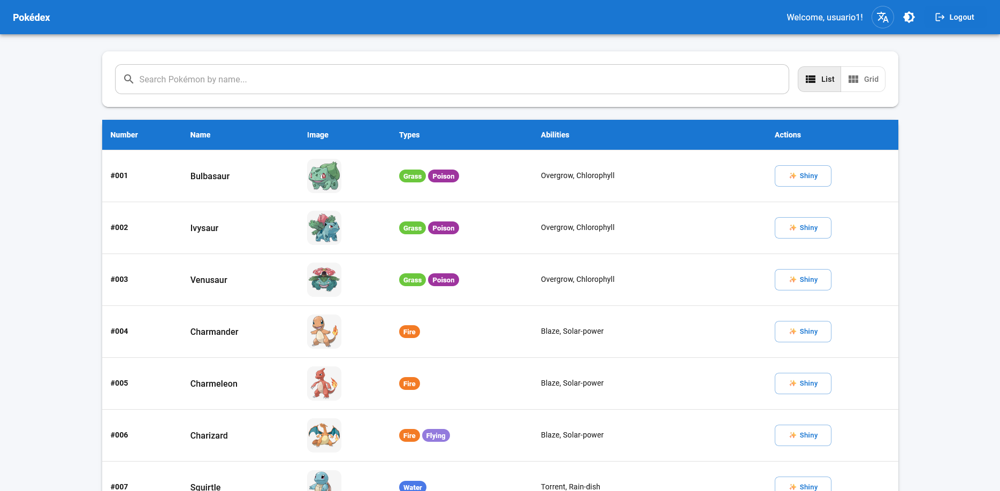
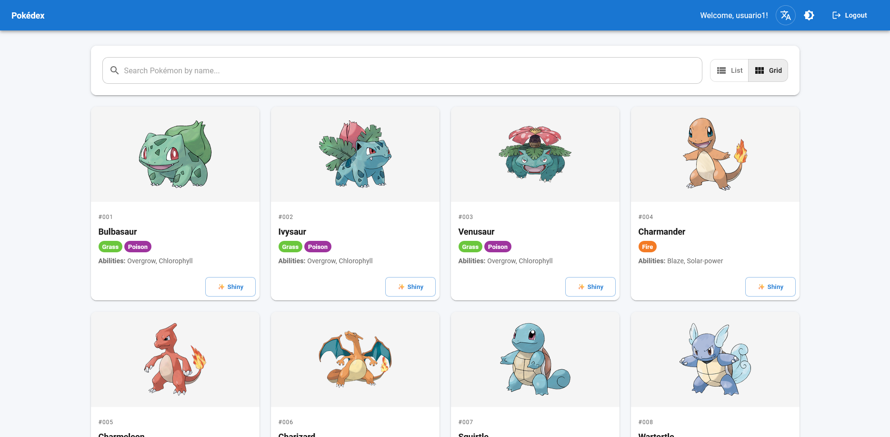
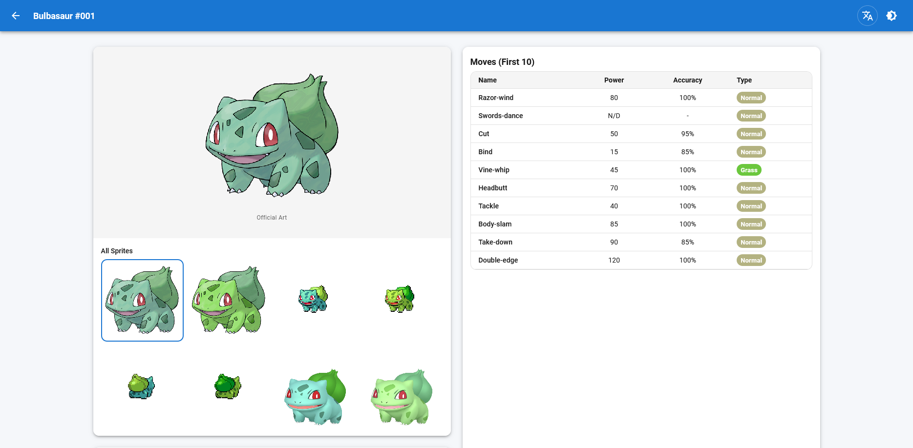
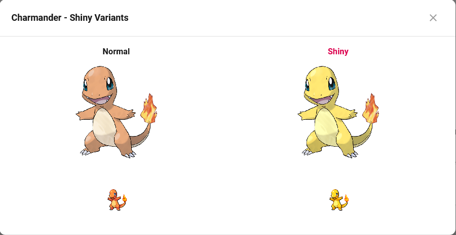

# Aplicación Web Pokédex

Una aplicación web moderna e interactiva de Pokédex construida con React, TypeScript y Material-UI. Esta aplicación permite a los usuarios navegar, buscar y ver información detallada sobre Pokémon utilizando la PokéAPI.

[English Version](./README.md)

## Características

### Funcionalidad Principal
- **Sistema de Autenticación**: Funcionalidad de inicio/cierre de sesión con validación de formularios y persistencia de sesión
- **Modos de Vista Duales**: Alterna entre vistas de Lista y Cuadrícula para navegar por los Pokémon
- **Funcionalidad de Búsqueda**: Búsqueda en tiempo real por nombre de Pokémon
- **Desplazamiento Infinito**: Paginación fluida en vista de Cuadrícula con carga automática
- **Páginas de Detalle**: Información completa del Pokémon incluyendo estadísticas, habilidades y movimientos
- **Variantes Shiny**: Ver y comparar versiones normales y shiny de los sprites
- **Soporte Bilingüe**: Alterna entre inglés y español con un clic
- **Alternador de Tema**: Cambia entre modo claro y oscuro
- **Diseño Responsivo**: Optimizado para escritorio, tablet y dispositivos móviles

### Características Técnicas
- **Gestión de Estado**: Redux Toolkit con RTK Query para caché eficiente de API
- **Seguridad de Tipos**: Implementación completa de TypeScript con verificación estricta de tipos
- **Validación de Formularios**: React Hook Form con validación de esquema Yup
- **Enrutamiento**: Rutas protegidas con React Router v6
- **Integración de API**: Consumo de API RESTful desde PokéAPI con lógica de reintento
- **Almacenamiento Local**: Persistencia de sesión y preferencias
- **Pruebas**: Pruebas unitarias y de integración con Vitest y React Testing Library
- **Soporte Docker**: Construcción Docker multi-etapa para despliegue en producción

## Capturas de Pantalla

### Vista de Lista


### Vista de Cuadrícula


### Página de Detalle


### Modal Shiny


### Modo Oscuro


## Stack Tecnológico

### Frontend
- **React 18.3** - Librería UI con componentes funcionales y hooks
- **TypeScript 5.6** - Verificación de tipos estática
- **Vite 7.1** - Herramienta de construcción rápida y servidor de desarrollo
- **Material-UI v6** - Librería de componentes y sistema de diseño
- **Redux Toolkit 2.5** - Gestión de estado
- **RTK Query** - Obtención y caché de datos
- **React Router v6** - Enrutamiento del lado del cliente
- **React Hook Form 7.54** - Manejo de formularios
- **Yup 1.4** - Validación de esquemas

### Desarrollo y Pruebas
- **Vitest 4.0** - Framework de pruebas unitarias
- **React Testing Library** - Utilidades de prueba de componentes
- **ESLint** - Análisis de código
- **TypeScript ESLint** - Reglas de análisis específicas de TypeScript

### Despliegue
- **Docker** - Contenerización
- **Nginx** - Servidor web para producción
- **Docker Compose** - Orquestación de contenedores

## Estructura del Proyecto

```
src/
├── app/                      # Configuración del store de Redux
│   ├── store.ts             # Configuración del store con reducers
│   ├── hooks.ts             # Hooks de Redux tipados
│   └── api.ts               # API base de RTK Query
├── features/                 # Módulos basados en características
│   ├── auth/                # Característica de autenticación
│   │   ├── authSlice.ts    # Gestión de estado de autenticación
│   │   ├── LoginForm.tsx   # Componente de formulario de login
│   │   └── LoginPage.tsx   # Página de login
│   └── pokedex/             # Característica Pokédex
│       ├── pokedexSlice.ts # Estado de Pokedex
│       ├── services/        # Servicios de API
│       ├── components/      # Componentes de la característica
│       └── pages/           # Páginas de la característica
├── components/               # Componentes compartidos
│   └── ui/                  # Componentes UI
├── contexts/                 # Contextos de React
│   └── LanguageContext.tsx # Proveedor de idioma
├── routes/                   # Configuración de enrutamiento
│   └── AppRouter.tsx        # Definiciones de rutas
├── styles/                   # Tema y estilos
│   ├── theme.ts            # Configuración de tema MUI
│   └── ThemeContext.tsx    # Proveedor de tema
├── types/                    # Definiciones de tipos TypeScript
│   ├── pokemon.ts          # Interfaces de PokéAPI
│   └── auth.ts             # Interfaces de autenticación
└── utils/                    # Funciones utilitarias
    ├── formatters.ts       # Helpers de formato de datos
    └── localStorage.ts     # Helpers de almacenamiento
```

## Requisitos Previos

- **Node.js**: Versión 20.x o superior
- **npm**: Versión 10.x o superior
- **Docker**: (Opcional) Para despliegue contenerizado
- **Docker Compose**: (Opcional) Para orquestación simplificada de contenedores

## Instalación

### Clonar el Repositorio

```bash
git clone https://github.com/pacheco20222/poke-app.git
cd poke-app
```

### Instalar Dependencias

```bash
npm install
```

## Ejecutar la Aplicación

### Opción 1: Desarrollo Local (Recomendado para Desarrollo)

Esta opción proporciona actualización rápida y reemplazo de módulos en caliente para una experiencia de desarrollo óptima.

1. **Iniciar el servidor de desarrollo:**

```bash
npm run dev
```

2. **Abrir el navegador:**

Navegar a `http://localhost:5173`

3. **Iniciar sesión:**

Usar cualquier nombre de usuario y contraseña (mínimo 6 caracteres). La autenticación es simulada con fines de demostración.

4. **Características de Desarrollo:**
   - Hot Module Replacement (HMR) para actualizaciones instantáneas
   - Source maps para depuración
   - Compilación rápida con Vite
   - Superposición de errores en el navegador

### Opción 2: Docker (Recomendado para Producción)

Esta opción crea una construcción lista para producción servida por Nginx.

#### Usando Docker Compose (Más Fácil)

1. **Construir e iniciar el contenedor:**

```bash
docker-compose up -d
```

2. **Abrir el navegador:**

Navegar a `http://localhost:3001`

3. **Detener el contenedor:**

```bash
docker-compose down
```

4. **Ver registros:**

```bash
docker-compose logs -f
```

#### Usando Comandos Docker

1. **Construir la imagen:**

```bash
docker build -t pokedex-app .
```

2. **Ejecutar el contenedor:**

```bash
docker run -p 3001:80 --name pokedex-frontend pokedex-app
```

3. **Detener el contenedor:**

```bash
docker stop pokedex-frontend
docker rm pokedex-frontend
```

## Scripts Disponibles

### Desarrollo

```bash
npm run dev          # Iniciar servidor de desarrollo
npm run build        # Construir para producción
npm run preview      # Previsualizar construcción de producción localmente
```

### Pruebas

```bash
npm test            # Ejecutar pruebas en modo observación
npm run test:run    # Ejecutar pruebas una vez
npm run test:ui     # Abrir UI de Vitest
```

### Análisis de Código

```bash
npm run lint        # Ejecutar ESLint
```

## Uso de la Aplicación

### Autenticación

1. Ingresar cualquier nombre de usuario
2. Ingresar una contraseña (mínimo 6 caracteres)
3. Hacer clic en "Iniciar sesión" o presionar Enter

La sesión se almacena en localStorage y persiste a través de las actualizaciones del navegador.

### Navegación de Pokémon

- **Vista de Lista**: Formato de tabla con botones de paginación en la parte inferior
- **Vista de Cuadrícula**: Diseño de tarjetas con desplazamiento infinito
- **Búsqueda**: Escribir el nombre del Pokémon en la barra de búsqueda para filtrado en tiempo real
- **Alternador de Vista**: Usar los botones en la parte superior derecha para cambiar entre Lista y Cuadrícula

### Página de Detalle

Hacer clic en cualquier Pokémon para ver:
- Ilustración oficial y galería de sprites
- Estadísticas físicas (altura, peso)
- Información de tipo con insignias codificadas por color
- Descripción en el idioma seleccionado
- Habilidades con descripciones detalladas
- Lista de movimientos con poder, precisión y tipo

### Alternador de Idioma

Hacer clic en el ícono de traducción en el encabezado para cambiar entre inglés y español. La preferencia de idioma se guarda y persiste entre sesiones.

### Alternador de Tema

Hacer clic en el ícono de tema en el encabezado para cambiar entre modo claro y oscuro. La preferencia se guarda en localStorage.

### Variantes Shiny

Hacer clic en el botón "Shiny" en cualquier Pokémon para ver una comparación entre sprites normales y shiny.

## Arquitectura Docker

La aplicación utiliza una construcción Docker multi-etapa:

1. **Etapa de Construcción**: Usa imagen Node.js Alpine para compilar TypeScript y construir el bundle de producción
2. **Etapa de Producción**: Usa imagen Nginx Alpine para servir archivos estáticos

Este enfoque resulta en una imagen de producción ligera (aproximadamente 75 MB) sin herramientas de construcción ni código fuente.

### Archivos de Configuración

- **Dockerfile**: Configuración de construcción multi-etapa
- **docker-compose.yml**: Orquestación de contenedores
- **nginx.conf**: Configuración del servidor web para enrutamiento SPA
- **.dockerignore**: Excluye archivos innecesarios de la construcción

## Integración de API

La aplicación se integra con [PokéAPI v2](https://pokeapi.co/) para todos los datos de Pokémon:

- **URL Base**: `https://pokeapi.co/api/v2`
- **Caché**: RTK Query proporciona deduplicación automática de solicitudes y almacenamiento en caché
- **Lógica de Reintento**: Las solicitudes fallidas se reintentan automáticamente con retroceso exponencial
- **Endpoints Utilizados**:
  - `/pokemon` - Información de lista y detalle
  - `/pokemon-species` - Descripciones de especies
  - `/ability` - Detalles de habilidades
  - `/move` - Información de movimientos

## Pruebas

El proyecto incluye pruebas comprensivas:

- **Pruebas Unitarias**: Funciones utilitarias y slices de Redux
- **Pruebas de Componentes**: Componentes React con interacciones de usuario
- **Pruebas de Integración**: Flujos de trabajo de características

Ejecutar pruebas con:

```bash
npm test            # Modo observación
npm run test:run    # Ejecución única
npm run test:ui     # UI interactiva
```

## Soporte de Navegadores

- Chrome (última versión)
- Firefox (última versión)
- Safari (última versión)
- Edge (última versión)

## Contribución

Este proyecto fue desarrollado como parte del Sunwise Frontend Challenge. Para contribuciones o problemas, por favor abrir un issue en GitHub.

## Licencia

Este proyecto está licenciado bajo la Licencia MIT. Ver el archivo LICENSE para más detalles.

## Agradecimientos

- [PokéAPI](https://pokeapi.co/) - La API RESTful de Pokémon
- [Material-UI](https://mui.com/) - Librería de componentes React
- [Redux Toolkit](https://redux-toolkit.js.org/) - Herramientas de gestión de estado
- Pokémon y los nombres de personajes Pokémon son marcas registradas de Nintendo
