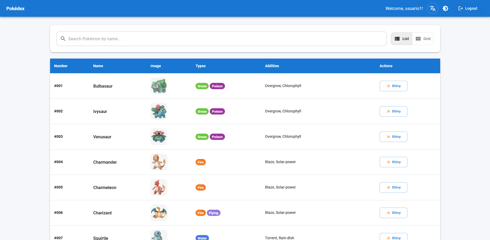
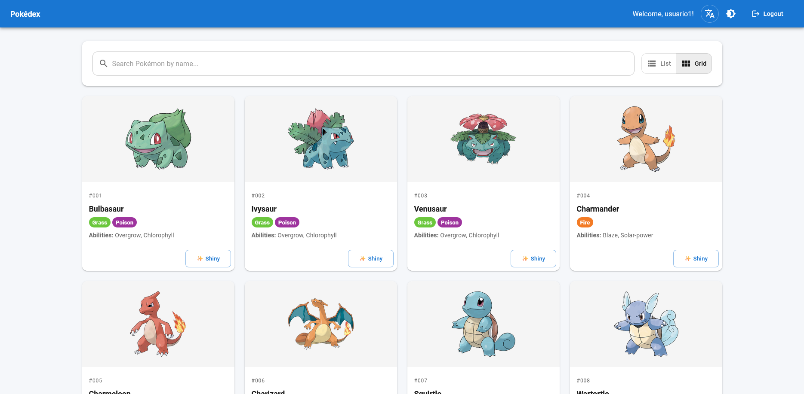
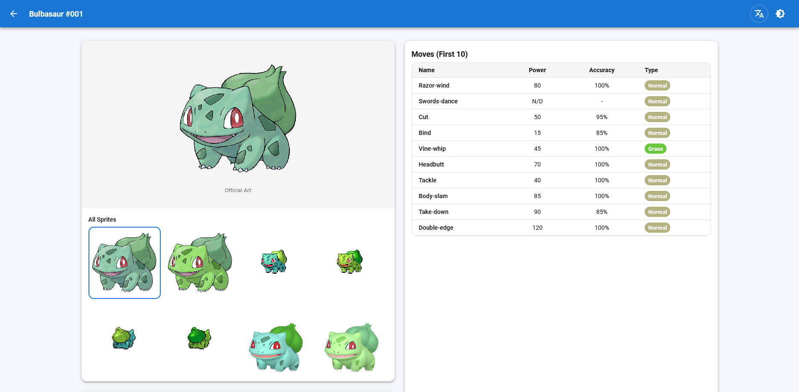
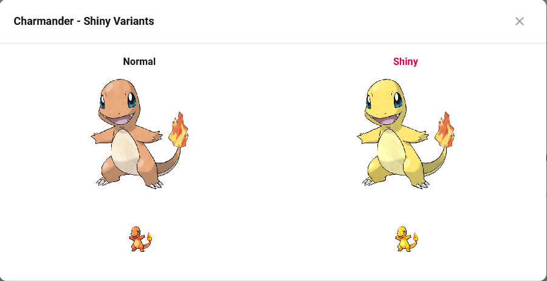
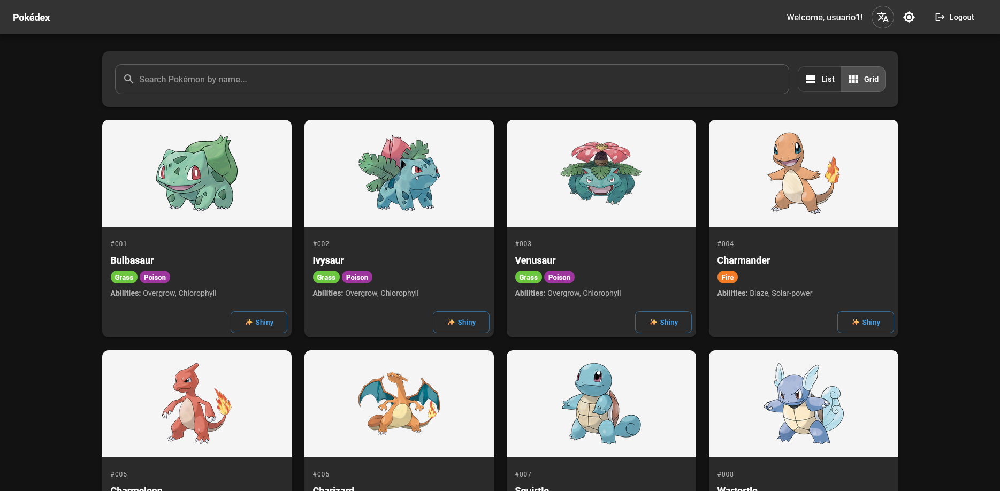

# Pokédex Web Application

A modern, interactive Pokédex web application built with React, TypeScript, and Material-UI. This application allows users to browse, search, and view detailed information about Pokémon using the PokéAPI.

[Versión en Español](./README.es.md)

## Features

### Core Functionality
- **Authentication System**: Login/logout functionality with form validation and session persistence
- **Dual View Modes**: Switch between List and Grid views for browsing Pokémon
- **Search Functionality**: Real-time search by Pokémon name
- **Infinite Scroll**: Seamless pagination in Grid view with automatic loading
- **Detail Pages**: Comprehensive Pokémon information including stats, abilities, and moves
- **Shiny Variants**: View and compare normal and shiny sprite versions
- **Bilingual Support**: Toggle between English and Spanish with one click
- **Theme Toggle**: Switch between light and dark mode
- **Responsive Design**: Optimized for desktop, tablet, and mobile devices

### Technical Features
- **State Management**: Redux Toolkit with RTK Query for efficient API caching
- **Type Safety**: Full TypeScript implementation with strict type checking
- **Form Validation**: React Hook Form with Yup schema validation
- **Routing**: Protected routes with React Router v6
- **API Integration**: RESTful API consumption from PokéAPI with retry logic
- **Local Storage**: Session and preference persistence
- **Testing**: Unit and integration tests with Vitest and React Testing Library
- **Docker Support**: Multi-stage Docker build for production deployment

## Screenshots

### List View


### Grid View


### Detail Page


### Shiny Modal


### Dark Mode


## Tech Stack

### Frontend
- **React 18.3** - UI library with functional components and hooks
- **TypeScript 5.6** - Static type checking
- **Vite 7.1** - Fast build tool and dev server
- **Material-UI v6** - Component library and design system
- **Redux Toolkit 2.5** - State management
- **RTK Query** - Data fetching and caching
- **React Router v6** - Client-side routing
- **React Hook Form 7.54** - Form handling
- **Yup 1.4** - Schema validation

### Development & Testing
- **Vitest 4.0** - Unit testing framework
- **React Testing Library** - Component testing utilities
- **ESLint** - Code linting
- **TypeScript ESLint** - TypeScript-specific linting rules

### Deployment
- **Docker** - Containerization
- **Nginx** - Web server for production
- **Docker Compose** - Container orchestration

## Project Structure

```
src/
├── app/                      # Redux store configuration
│   ├── store.ts             # Store setup with reducers
│   ├── hooks.ts             # Typed Redux hooks
│   └── api.ts               # RTK Query base API
├── features/                 # Feature-based modules
│   ├── auth/                # Authentication feature
│   │   ├── authSlice.ts    # Auth state management
│   │   ├── LoginForm.tsx   # Login form component
│   │   └── LoginPage.tsx   # Login page
│   └── pokedex/             # Pokédex feature
│       ├── pokedexSlice.ts # Pokedex state
│       ├── services/        # API services
│       ├── components/      # Feature components
│       └── pages/           # Feature pages
├── components/               # Shared components
│   └── ui/                  # UI components
├── contexts/                 # React contexts
│   └── LanguageContext.tsx # Language provider
├── routes/                   # Routing configuration
│   └── AppRouter.tsx        # Route definitions
├── styles/                   # Theme and styling
│   ├── theme.ts            # MUI theme configuration
│   └── ThemeContext.tsx    # Theme provider
├── types/                    # TypeScript type definitions
│   ├── pokemon.ts          # PokéAPI interfaces
│   └── auth.ts             # Auth interfaces
└── utils/                    # Utility functions
    ├── formatters.ts       # Data formatting helpers
    └── localStorage.ts     # Storage helpers
```

## Prerequisites

- **Node.js**: Version 20.x or higher
- **npm**: Version 10.x or higher
- **Docker**: (Optional) For containerized deployment
- **Docker Compose**: (Optional) For simplified container orchestration

## Installation

### Clone the Repository

```bash
git clone https://github.com/pacheco20222/poke-app.git
cd poke-app
```

### Install Dependencies

```bash
npm install
```

## Running the Application

### Option 1: Local Development (Recommended for Development)

This option provides fast refresh and hot module replacement for an optimal development experience.

1. **Start the development server:**

```bash
npm run dev
```

2. **Open your browser:**

Navigate to `http://localhost:5173`

3. **Login:**

Use any username and password (minimum 6 characters). The authentication is simulated for demonstration purposes.

4. **Development Features:**
   - Hot Module Replacement (HMR) for instant updates
   - Source maps for debugging
   - Fast compilation with Vite
   - Error overlay in browser

### Option 2: Docker (Recommended for Production)

This option creates a production-ready build served by Nginx.

#### Using Docker Compose (Easiest)

1. **Build and start the container:**

```bash
docker-compose up -d
```

2. **Open your browser:**

Navigate to `http://localhost:3001`

3. **Stop the container:**

```bash
docker-compose down
```

4. **View logs:**

```bash
docker-compose logs -f
```

#### Using Docker Commands

1. **Build the image:**

```bash
docker build -t pokedex-app .
```

2. **Run the container:**

```bash
docker run -p 3001:80 --name pokedex-frontend pokedex-app
```

3. **Stop the container:**

```bash
docker stop pokedex-frontend
docker rm pokedex-frontend
```

## Available Scripts

### Development

```bash
npm run dev          # Start development server
npm run build        # Build for production
npm run preview      # Preview production build locally
```

### Testing

```bash
npm test            # Run tests in watch mode
npm run test:run    # Run tests once
npm run test:ui     # Open Vitest UI
```

### Linting

```bash
npm run lint        # Run ESLint
```

## Application Usage

### Authentication

1. Enter any username
2. Enter a password (minimum 6 characters)
3. Click "Login" or press Enter

The session is stored in localStorage and persists across browser refreshes.

### Browsing Pokémon

- **List View**: Table format with pagination buttons at the bottom
- **Grid View**: Card layout with infinite scroll
- **Search**: Type Pokémon name in the search bar for real-time filtering
- **View Toggle**: Use the buttons in the top-right to switch between List and Grid

### Detail Page

Click on any Pokémon to view:
- Official artwork and sprite gallery
- Physical stats (height, weight)
- Type information with color-coded badges
- Description in the selected language
- Abilities with detailed descriptions
- Move list with power, accuracy, and type

### Language Toggle

Click the translate icon in the header to switch between English and Spanish. The language preference is saved and persists across sessions.

### Theme Toggle

Click the theme icon in the header to switch between light and dark mode. The preference is saved in localStorage.

### Shiny Variants

Click the "Shiny" button on any Pokémon to view a comparison between normal and shiny sprites.

## Docker Architecture

The application uses a multi-stage Docker build:

1. **Build Stage**: Uses Node.js Alpine image to compile TypeScript and build the production bundle
2. **Production Stage**: Uses Nginx Alpine image to serve static files

This approach results in a lightweight production image (approximately 75 MB) without build tools or source code.

### Configuration Files

- **Dockerfile**: Multi-stage build configuration
- **docker-compose.yml**: Container orchestration
- **nginx.conf**: Web server configuration for SPA routing
- **.dockerignore**: Excludes unnecessary files from the build

## API Integration

The application integrates with [PokéAPI v2](https://pokeapi.co/) for all Pokémon data:

- **Base URL**: `https://pokeapi.co/api/v2`
- **Caching**: RTK Query provides automatic request deduplication and caching
- **Retry Logic**: Failed requests are automatically retried with exponential backoff
- **Endpoints Used**:
  - `/pokemon` - List and detail information
  - `/pokemon-species` - Species descriptions
  - `/ability` - Ability details
  - `/move` - Move information

## Testing

The project includes comprehensive tests:

- **Unit Tests**: Utility functions and Redux slices
- **Component Tests**: React components with user interactions
- **Integration Tests**: Feature workflows

Run tests with:

```bash
npm test            # Watch mode
npm run test:run    # Single run
npm run test:ui     # Interactive UI
```

## Browser Support

- Chrome (latest)
- Firefox (latest)
- Safari (latest)
- Edge (latest)

## Contributing

This project was developed as part of the Sunwise Frontend Challenge. For contributions or issues, please open a GitHub issue.

## License

This project is licensed under the MIT License. See the LICENSE file for details.

## Acknowledgments

- [PokéAPI](https://pokeapi.co/) - The RESTful Pokémon API
- [Material-UI](https://mui.com/) - React component library
- [Redux Toolkit](https://redux-toolkit.js.org/) - State management tools
- Pokémon and Pokémon character names are trademarks of Nintendo
